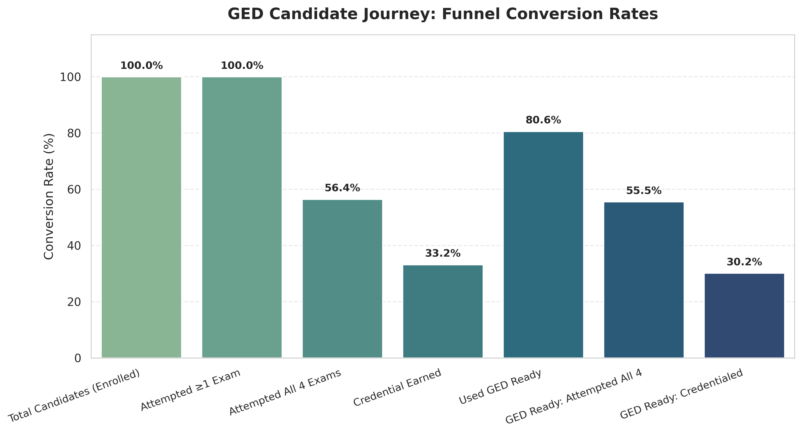
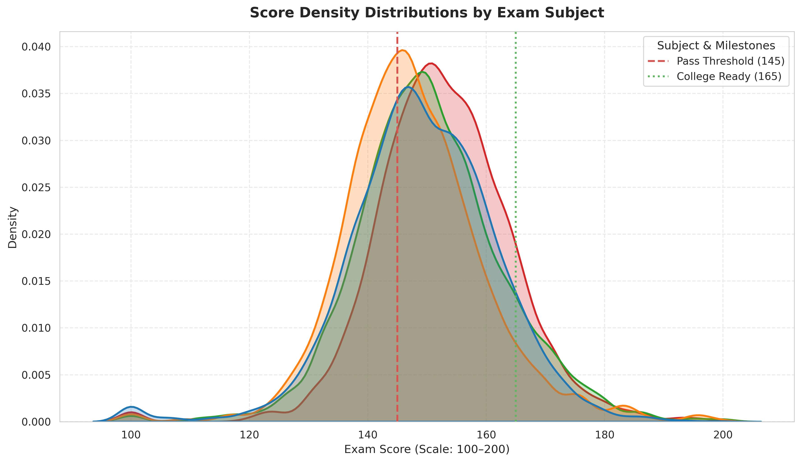
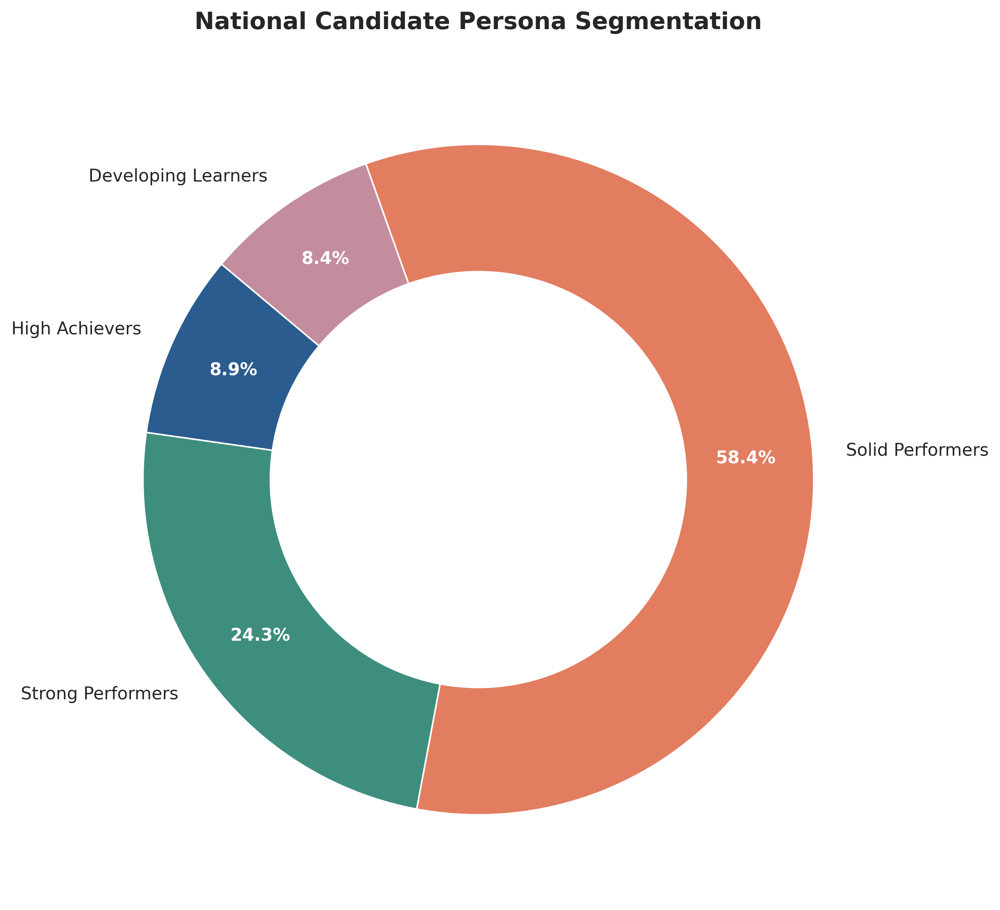
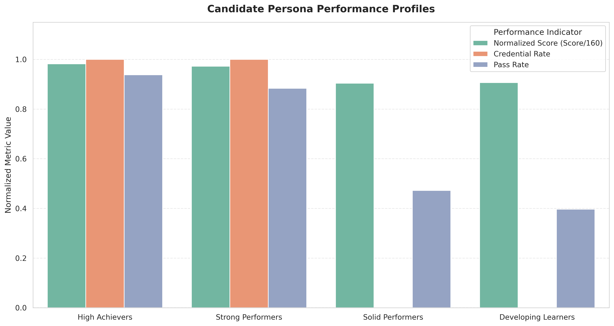
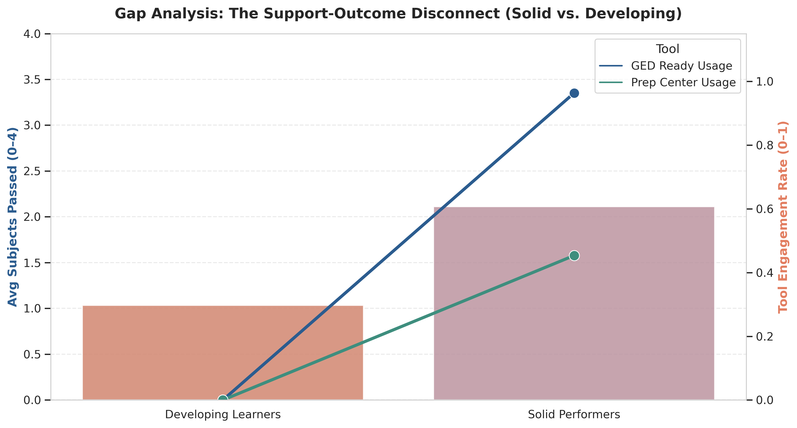
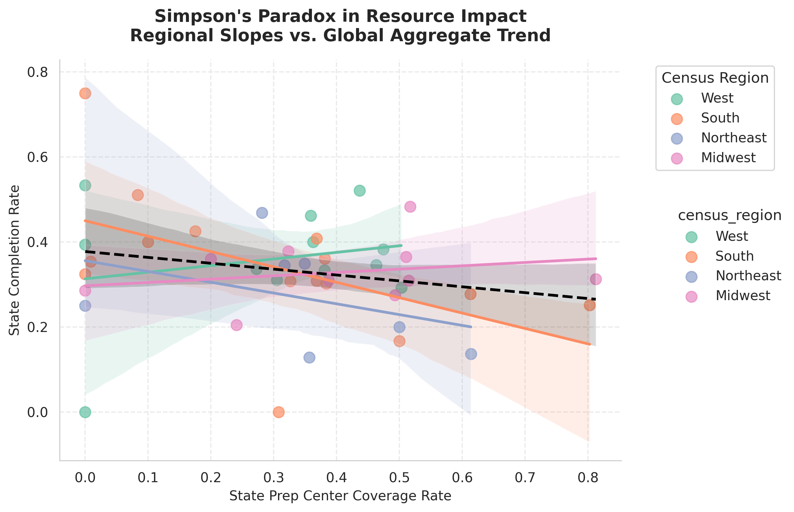
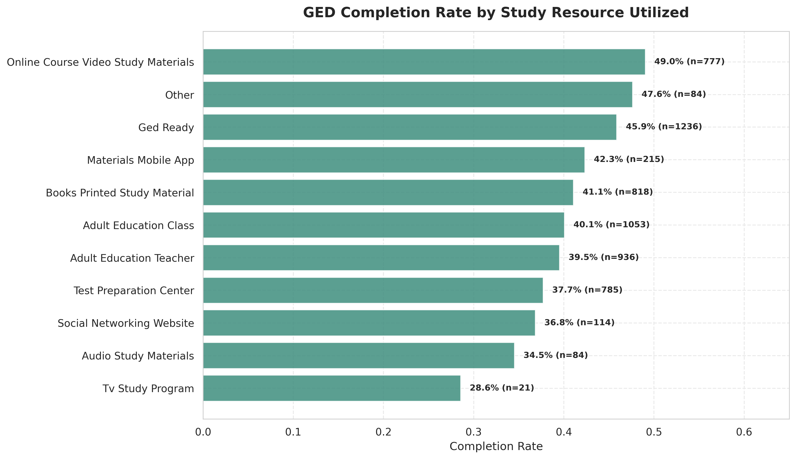
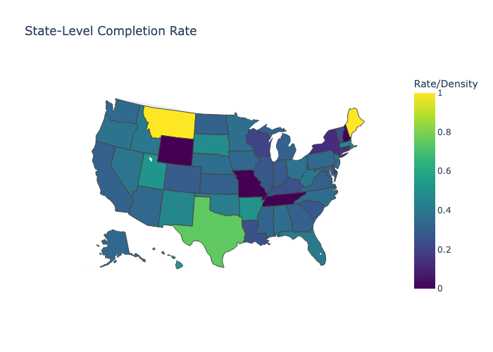
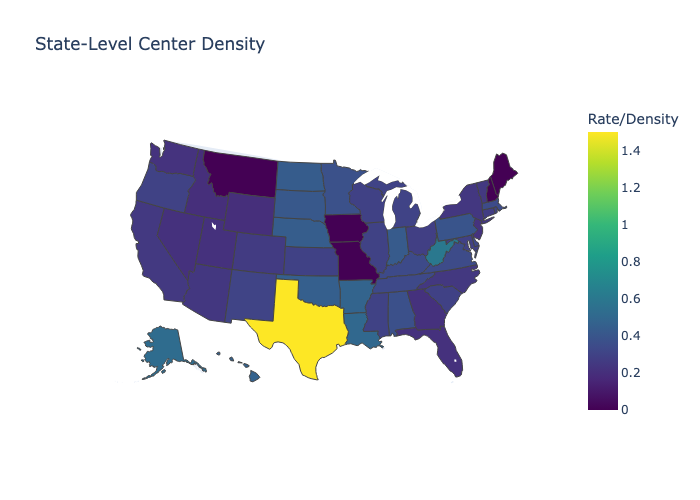
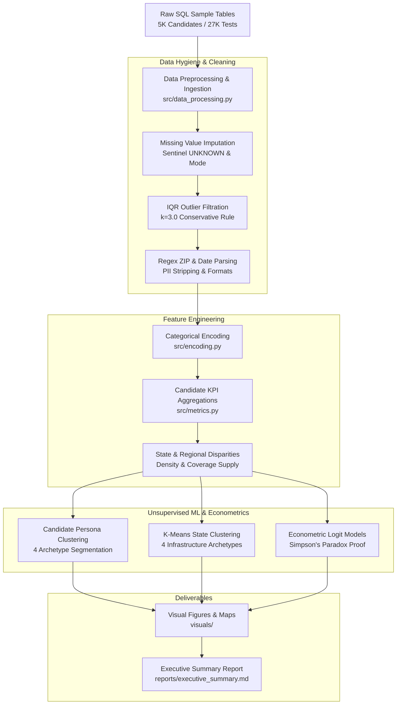

<div align="center">

# 🎓 GED Candidate Journey, Behavioral Personas & Econometric Disparity Analysis

**An End-to-End Enterprise Analytics, Unsupervised Segmentation & Econometric Research Portfolio**

[](https://www.python.org/)
[](https://scikit-learn.org/)
[](https://www.statsmodels.org/)
[](https://plotly.com/)
[](tests/)
[](LICENSE)

*Investigating adult education pathways, subject-level attrition chokepoints, behavioral candidate segmentation, and spatial resource disparities across 4,600+ candidates and 25,600+ longitudinal exam attempts.*

[Executive Summary](#-executive-summary--business-impact) • [Key Discoveries](#-key-analytical-discoveries--visual-showcase) • [Candidate Personas](#-unsupervised-candidate-personas-k4) • [Architecture](#-data-pipeline--system-architecture) • [Quickstart](#-quickstart--reproducibility) • [Reports & Docs](reports/)

---

</div>

## 📌 Executive Summary & Business Impact

Earning a General Educational Development (GED) credential is a pivotal socioeconomic milestone for adult learners, unlocking vocational certifications, college enrollment, and career advancement. However, national credential rates suffer from significant friction across the candidate journey.

This research project conducts an econometric and machine learning deep-dive into candidate-level exam trajectories and state-level infrastructure supply to address three foundational questions:

```text
┌────────────────────────────────────────────────────────────────────────────────────────────────┐
│                                    CORE RESEARCH QUESTIONS                                     │
├────────────────────────────────────────────────────────────────────────────────────────────────┤
│ 1. Funnel Attrition: Why do 61.4% of candidates take all exams, but only 41.5% earn diplomas?  │
│ 2. Behavioral Archetypes: How do learner behaviors and prep tool utilization segment outcomes? │
│ 3. Spatial Disparity & Paradox: Why does prep center coverage correlate negatively with scores?│
└────────────────────────────────────────────────────────────────────────────────────────────────┘
```

### 💡 High-Level Quantitative Insights (TL;DR)

```text
┌──────────────────────────┬──────────────────────────┬──────────────────────────┬──────────────────────────┐
│   Total Exam Attempts    │   Candidates Analyzed    │    Pass-Credential Gap   │  Largest At-Risk Group   │
│         25,657           │          4,691           │      ~20.0% Drop-off     │    Solid Performers      │
│  (Longitudinal Attempts) │    (Cleaned Sample)      │   (Math Chokepoint)      │   (45.1% of Learners)    │
└──────────────────────────┴──────────────────────────┴──────────────────────────┴──────────────────────────┘
```

1. **The 20-Point Pass-to-Credential Gap:** A sharp drop-off exists between *Full Exam Participation* (61.4%) and *Credential Completion* (41.5%). Mathematics represents the decisive bottleneck with the highest failure density.
2. **The "Solid Performer" Paradox (45.1% of Population):** Nearly half of all learners actively engage with test prep centers and practice exams, yet fail to credential due to narrow 1–2 point deficiencies in Mathematics.
3. **Selection Bias & Simpson's Paradox:** Preparation centers attract disproportionately lower-scoring candidates, generating an apparent negative national correlation between prep availability and scores. When controlled for Census Regions, positive returns to structured preparation re-emerge.
4. **Physical Center Density Decisive in Completion:** Econometric Logit modeling demonstrates that physical **Testing Center Density** ($p < 0.05$) is a statistically significant driver of final credential completion.

---

## 📊 Key Analytical Discoveries & Visual Showcase

### 1. The Candidate Journey Funnel & Math Chokepoint
The journey from registration to credentialing experiences a steep conversion cliff after subject exams.

<div align="center">
  
</div>

#### Subject Score Density Distributions
Evaluation of continuous score curves against the **145 Pass Threshold** and **165 College-Ready Threshold**:
* **Mathematics:** Peaks closest to 145 and has the largest left-tail below passing threshold.
* **Science & Social Studies:** Comfortably skew above 150 with high first-time pass rates.
* **Reasoning through Language Arts:** Exhibits the widest variance across student cohorts.

<div align="center">
  
</div>

---

### 2. Unsupervised Candidate Personas ($K=4$)

Candidates were clustered into four distinct behavioral archetypes based on preparation usage, retake frequency, and outcome trajectories:

<div align="center">
  
  
</div>

| Persona | Share (%) | Avg Score | Credential Rate | Support Engagement | Behavioral Profile & Strategic Intervention |
| :--- | :---: | :---: | :---: | :---: | :--- |
| **🥇 High Achievers** | **11.2%** | 157.4 | **100.0%** | Low / Direct | Academically prepared; pass on first attempt with minimal prep. Fast-track to college advising. |
| **🥈 Strong Performers** | **30.2%** | 152.1 | **100.0%** | High (GED Ready) | Utilize digital prep tools effectively to overcome initial gaps and achieve credentials. |
| **🥉 Solid Performers** | **45.1%** | 146.2 | **0.0%** | **Highest (Prep + Ready)** | **High-effort, high-prep learners stuck 1–3 points below passing in Math. Priority target for intervention.** |
| **🚨 Developing Learners** | **13.5%** | 144.8 | **0.0%** | Minimal / Disengaged | Lowest scores, zero prep tool engagement, low retake rate. Require wraparound literacy support. |

#### Gap Analysis: Solid Performers vs. Developing Learners
Why do Solid Performers fail despite high prep center and practice exam usage? The gap analysis reveals they pass an average of **2.8 out of 4 subjects**, failing solely on Mathematics/Reasoning.

<div align="center">
  
</div>

---

### 3. The Support Paradox & Simpson's Paradox
At first glance, states with higher prep center coverage exhibit lower completion rates ($r = -0.364$). This counter-intuitive finding is explained by two phenomena:
1. **Selection Bias:** Struggling students seek prep centers, while high achievers bypass them.
2. **Simpson's Paradox:** When disaggregated by Census Region (Northeast, Midwest, South, West), regional trends reveal positive or stabilizing effects.

<div align="center">
  
</div>

#### Preparation Resource Effectiveness Comparison
Ranked completion rate comparison across specific prep resources ($n \ge 10$):

<div align="center">
  
</div>

---

### 4. Econometric Disparity & Spatial Infrastructure Modeling

Using candidate-level Logit modeling with regional and demographic controls:
$$\text{logit}\left(P(\text{Credential}_i = 1)\right) = \beta_0 + \beta_1 \cdot \text{CenterDensity}_s + \beta_2 \cdot \text{PrepCoverage}_s + \beta_3 \cdot \text{Age}_i + \mathbf{X}_i'\boldsymbol{\gamma} + \varepsilon_i$$

* **Testing Center Density ($\beta_1$):** Positively and significantly associated with completion ($p < 0.05$). Physical proximity to test centers reduces exam cancellation friction.
* **Online Testing (OnVUE):** Candidates leveraging online proctored testing achieve higher completion rates (54.2% vs. 38.6% for center-only testers in specific cohorts).

<div align="center">
  
  
</div>

---

## 🏗 Data Pipeline & System Architecture

The pipeline processes raw relational samples into production-ready analytical datasets, statistical models, and visual outputs:



---

## 📂 Repository Architecture

```text
GED_EDA_Project/
├── .github/
│   └── workflows/
│       └── ci.yml                   # Automated GitHub Actions CI workflow (pytest)
├── data/
│   ├── raw_sample/                  # Raw candidate & test sample data
│   │   ├── candidate_table_raw_sample.xlsx
│   │   └── test_data_table_raw_sample.xlsx
│   └── processed/                   # Standardized processed datasets
│       ├── candidate_cleaned.xlsx
│       ├── test_cleaned.xlsx
│       ├── 3_candidate_test_attempts.csv
│       ├── 4_test_candidate_cleaned_qual_2_quant.xlsx
│       ├── 5_test_candidate_cleaned_final.csv
│       ├── 6_candidates_cleaned.xlsx
│       └── missing_value_report.csv
├── docs/ / reports/                 # Formal executive deliverables & research reports
│   ├── executive_summary.md         # Comprehensive executive insights brief
│   ├── candidate_clustering_report.pdf
│   └── regional_resources_disparity_report.docx
├── notebooks/                       # Narrative-driven, sequentially structured notebooks
│   ├── 01_missing_value_analysis.ipynb
│   ├── 02_outlier_detection_distribution.ipynb
│   ├── 03_candidate_test_merge.ipynb
│   ├── 04_feature_encoding_and_types.ipynb
│   ├── 05_data_type_standardization.ipynb
│   ├── 06_exploratory_data_analysis.ipynb
│   ├── 07_candidate_clustering_personas.ipynb
│   ├── 08_regional_disparities_econometrics.ipynb
│   └── r_models/                    # Clean R and R Markdown statistical models
│       ├── hierarchical_clustering_diana.R
│       ├── k_medoids.Rmd
│       └── k_prototypes.Rmd
├── src/                             # Core modular Python package (ged_analytics)
│   ├── __init__.py                  # Package exports & metadata
│   ├── config.py                    # Dynamic root/data/visuals path resolutions & constants
│   ├── data_processing.py           # Missing values, IQR outlier filtering, type fixing, regex zips
│   ├── encoding.py                  # Categorical schemas, qualitative-to-quantitative mapping
│   ├── metrics.py                   # Funnel metrics, completion rates, center density, prep coverage
│   ├── clustering.py                # Candidate segmentation, state clustering, persona profiling
│   ├── modeling.py                  # Logit econometric models, Simpson's paradox tests, stats
│   ├── visualization.py             # Publication-grade styling, palettes, chart & map generators
│   └── pipeline.py                  # End-to-end reproducible analytical execution engine
├── scripts/                         # Standalone CLI tools & master pipeline runner
│   ├── run_pipeline.py              # Master CLI runner executing all analyses
│   ├── analyze_correlation.py       # State/regional correlation calculator
│   ├── analyze_prep_center_deepdive.py
│   ├── analyze_resource_impact.py   # Prep resource impact evaluator
│   ├── analyze_test_method.py       # Online vs physical testing comparison
│   ├── cluster_states.py            # State archetype clustering
│   ├── generate_candidate_personas.py # Candidate persona generator
│   ├── generate_coverage_table.py   # State concentration summary table
│   ├── generate_maps.py             # Plotly state/regional choropleth maps
│   ├── generate_prep_table.py       # State coverage markdown generator
│   ├── generate_regional_visuals.py # Regional performance breakdown charts
│   └── visualize_paradox.py         # Simpson's paradox visual generator
├── sql/                             # Extraction & sampling queries
│   ├── sample_data_script.sql       # T-SQL sampling & extraction script
│   └── README.md                    # SQL extraction methodology & schema notes
├── tests/                           # Complete automated pytest test suite
│   ├── __init__.py
│   ├── conftest.py                  # Synthetic candidate & exam data fixtures
│   ├── test_data_processing.py      # Tests for IQR detection, null indicators, zip standardizer
│   ├── test_encoding.py             # Tests for categorical schema transformations
│   ├── test_metrics.py              # Tests for funnel metrics, rates, density formulas
│   └── test_clustering.py           # Tests for persona logic and state clustering
├── visuals/                         # High-resolution charts, maps, and figures
├── .gitignore                       # Clean Python / Data Science gitignore
├── pyproject.toml                   # Modern Python build & tool configuration
├── requirements.txt                 # Complete, pinned dependency list
└── README.md                        # Portfolio showcase document
```

---

## 🚀 Quickstart & Reproducibility

### 1. Clone & Environment Setup
```bash
# Clone the repository
git clone https://github.com/ShivanshuDagur/GED_EDA_Project.git
cd GED_EDA_Project

# Create and activate virtual environment
python3 -m venv .venv
source .venv/bin/activate  # On Windows: .venv\Scripts\activate

# Install dependencies and editable package
pip install -r requirements.txt
pip install -e .
```

### 2. Run the Full Analytical Pipeline
Regenerate all metrics, persona segmentations, econometric models, and visual assets with a single command:
```bash
python scripts/run_pipeline.py
```

### 3. Run Automated Tests
Execute the unit test suite covering data cleaning, encoding, metrics, and clustering:
```bash
pytest -v tests/
```

### 4. Run Individual Analysis Modules
```bash
# Analyze Simpson's Paradox and regional correlations
python scripts/analyze_correlation.py

# Generate candidate personas and profiles
python scripts/generate_candidate_personas.py

# Perform state infrastructure clustering
python scripts/cluster_states.py
```

---

## 🛡 Data Hygiene & Methodology Protocols

### Missing Value Imputation Strategy
* **Categorical Fields (`GENDER`, `ETHNICITY`, `PREP_CENTER`, `TEST_CENTER_ID`):** Imputed with `"UNKNOWN"` sentinel string to preserve population volume while isolating missingness.
* **Continuous Scores & Dates:** Retained original values without synthetic distortion and added binary `*_MISSING` indicator flags (e.g. `CREDENTIAL_DATE_MISSING`, `SCORE_MISSING`).

### IQR Outlier Threshold ($k=3.0$)
* **Comparison:** At standard $k=1.5$, outlier removal discarded $>10.28\%$ of exam records, purging informative retake attempts.
* **Decision:** Selected conservative threshold $k=3.0$ (retaining $92.33\%$ of exam records and $98.98\%$ of candidate records), effectively removing extreme formatting errors without pruning legitimate repeated testing behavior.

### Data Privacy Compliance
* All candidate Personally Identifiable Information (`C_ADDRESS`, `DATE_OF_BIRTH`, `FIRST_NAME`, `LAST_NAME`, `SSN`) is programmatically stripped in data processing (`src.encoding.strip_pii_columns`).

---

## 👥 Authors & Academic Context

* **Shivanshu Dagur** — Lead MSBA Analytics & Research
* **Academic Program:** Master of Science in Business Analytics (MSBA)
* **Domain:** Workforce Analytics, Adult Education Policy, Econometric Modeling

---

<div align="center">
  <b>⭐ If you find this research portfolio insightful, please star the repository! ⭐</b>
</div>
