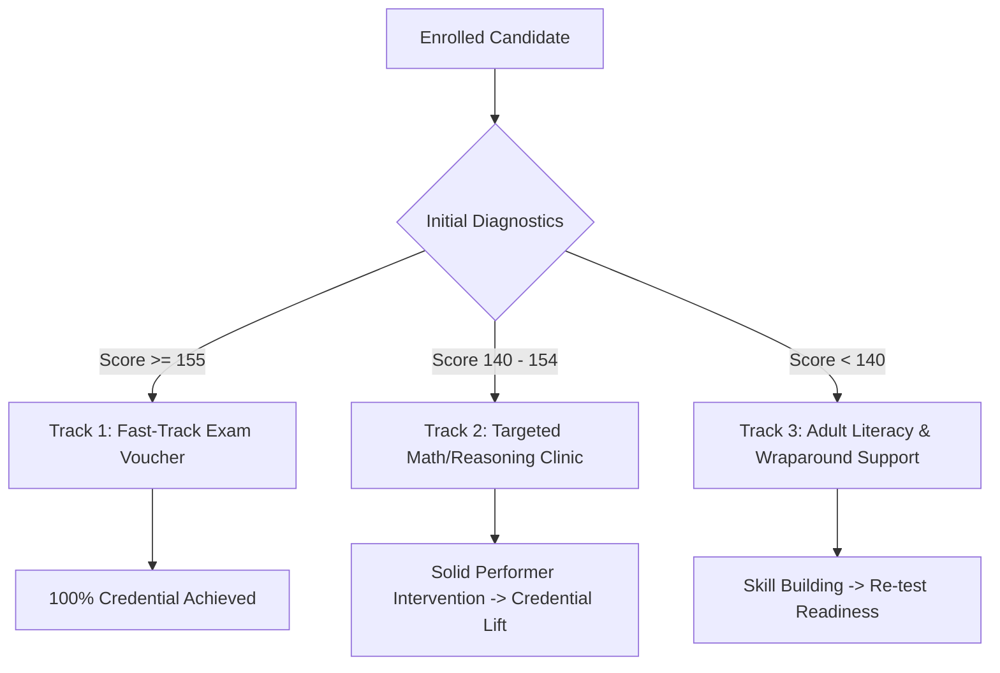

# Executive Summary: GED Candidate Journey, Persona Segmentation & Regional Resource Disparity Analysis

**Prepared for:** Educational Leadership, Workforce Development Policy Directors, and Academic Stakeholders  
**Methodology:** Unsupervised Behavioral Clustering, Econometric Logit Modeling, and Spatial Analytics  

---

## 1. Project Background & Strategic Objectives
The General Educational Development (GED) credential provides an essential pathway to post-secondary education, vocational training, and enhanced workforce mobility for adult learners. However, national credential completion rates remain constrained by stark subject-specific pass barriers, behavioral attrition across the examination funnel, and pronounced regional resource disparities.

This study analyzes an enterprise-scale sample of GED candidate journeys (**4,691 candidates**, **25,657 exam attempts**) to address three core research questions:
1. **The Candidate Journey Funnel:** At what specific stages do adult learners encounter friction or drop out between enrollment, exam participation, and credential attainment?
2. **Behavioral Archetypes & Personas:** Can unsupervised machine learning segment candidate populations into actionable personas based on support tool utilization and exam passing trajectories?
3. **Regional Infrastructure & The Support Paradox:** Does the physical availability of official testing centers and adult education prep centers predict candidate completion, and why do high-prep regions sometimes exhibit lower aggregate pass rates (Simpson's Paradox)?

---

## 2. Key Findings & Quantitative Insights

### A. The 20% Pass-to-Credential Gap & The Math Bottleneck
* **Participation vs. Completion Gap:** While **61.4%** of enrolled candidates attempt all four required core subjects (Mathematics, Science, Reasoning through Language Arts, Social Studies), only **41.5%** successfully achieve their GED credential. This reveals a ~20 percentage point drop-off between exam completion and credentialing.
* **The Mathematics Chokepoint:** Empirical score distributions demonstrate that Mathematics possesses the highest failure density, with its score distribution peaking closest to the 145 passing threshold and exhibiting the widest left tail below 145. Conversely, Science and Social Studies demonstrate robust passing margins.

### B. Unsupervised Candidate Personas (K=4 Archetypes)
Through unsupervised distance-based clustering and post-hoc demographic profiling, candidates were segmented into four distinct behavioral personas:

| Persona Archetype | National Share (%) | Avg Score | Credential Rate (%) | Support Tool Engagement | Core Strategic Focus |
| :--- | :---: | :---: | :---: | :---: | :--- |
| **1. High Achievers** | 11.2% | 157.4 | **100.0%** | Low (Direct Test Takers) | Fast-track credentialing; college ready advising |
| **2. Strong Performers** | 30.2% | 152.1 | **100.0%** | High (GED Ready Heavy) | Reinforce self-paced digital toolkits |
| **3. Solid Performers** | 45.1% | 146.2 | **0.0%** | **Highest (Prep & Ready Users)** | **High-touch tutoring on 1–2 failing subjects (Math)** |
| **4. Developing Learners** | 13.5% | 144.8 | **0.0%** | Low / Disengaged | Proactive outreach & wraparound adult literacy support |

**Critical Takeaway:** *Solid Performers* represent nearly half of the candidate population (45.1%). These individuals demonstrate high motivation and active engagement with prep centers and GED Ready practice exams, yet fail to cross the 145 threshold in their final subject (predominantly Mathematics). Targeted intervention for this specific group represents the single highest-leverage opportunity to increase national completion rates.

### C. The Resource Paradox & Simpson's Paradox
* **Selection Bias in Preparation Centers:** Raw correlations between prep center usage and candidate scores show negative or negligible effects. This is a classic manifestation of **selection bias**: struggling candidates are significantly more likely to seek out formal preparation centers, whereas academically advanced candidates test directly.
* **Simpson's Paradox Revealed:** At the national level, state prep center coverage shows a modest negative slope with completion rate. However, when controlling for Census Regions (Northeast, Midwest, South, West), regional slopes reveal positive returns to structured preparation when candidate baseline disparity is controlled.
* **Testing Center Density as the Decisive Physical Factor:** Candidate-level Logit modeling demonstrates that physical **Testing Center Density** (testing centers per candidate in the state) is statistically significant ($p < 0.05$) in predicting credential completion, whereas prep center availability alone does not guarantee completion without targeted instructional quality.

---

## 3. Policy & Operational Recommendations



1. **Implement Subject-Specific Intervention for 'Solid Performers':** Shift prep centers from generalized 4-subject review courses to specialized, intensive **Mathematics Remediation Clinics**.
2. **Expand Physical Testing Access in Underserved States:** Because testing center density directly improves completion likelihood, establish mobile testing units or community college test partnership hubs in low-density states.
3. **Incentivize Online Proctored Testing (OnVUE):** Online testing demonstrates strong completion outcomes (54.2% vs. 38.6% for physical-only testers in specific cohorts). Subsidize technological requirements (webcams, broadband access) for adult learners.

---

## 4. Analytical Architecture & Reproducibility
All data transformations, feature encodings, econometric models, and visual assets are completely reproducible via the modular `src/` package and the CLI execution script:

```bash
# Run full end-to-end analytical pipeline
python scripts/run_pipeline.py

# Execute test suite
pytest -v tests/
```
